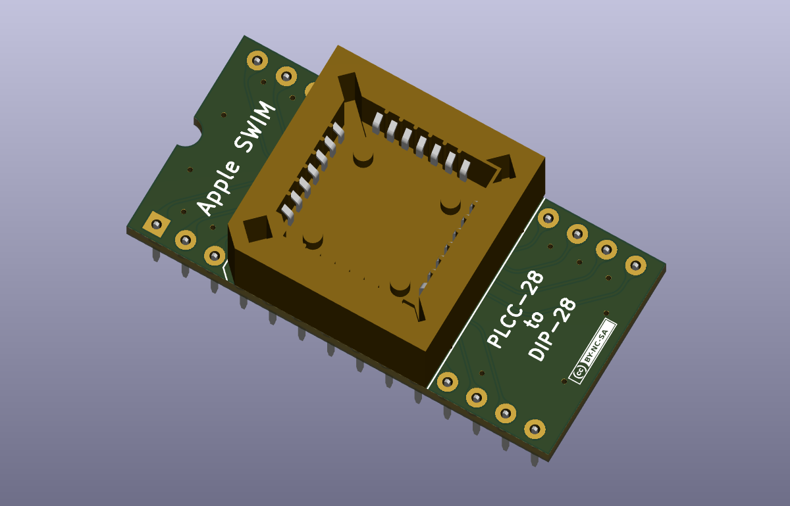
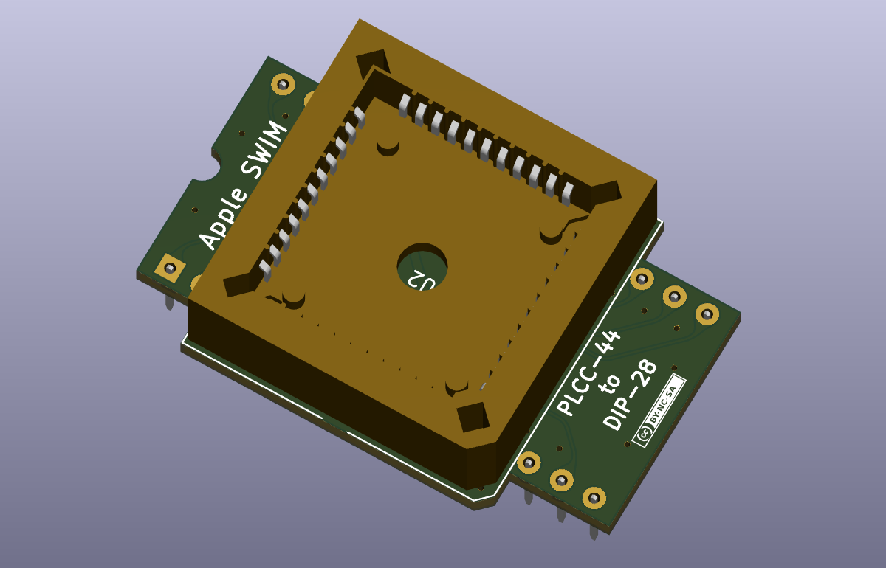

# Apple SWIM Chip Adapters

This project is for a couple of chip adapters to convert the PLCC-28 and PLCC-44 Apple SWIM chips to DIP-28.

The intention of the project was to allow me to use the PLCC-44 SWIM chip from my battery bombed Macintosh Classic in a Macintosh SE to give it 1.44MB floppy drive support.

The PLCC-28 and DIP-28 SWIM chips have the exact same pin layout (i.e., pin 1 goes to pin 1, pin 2 to pin 2, etc). This means that PLCC-28 to DIP-28 adapter can be used with universal programmers as well.

 The pinouts of the SWIM chips was found in the [SWIM_Chip_User's_Reference](docs/info/SWIM_Chip_Users_Ref_198801.pdf). 

## Bill of Materials

### Apple SWIM Chip PLCC-28 to DIP-28  Adapter

| Quantity | Description                  | Designators | Product Number | Datasheet                                        |
| :------- | ---------------------------- | ----------- | -------------- | ------------------------------------------------ |
| 1        | Supercapacitor balancing IC. | U2          | PLCC-28-AT     | [pdf](docs/datasheets/plcc-28-at-data-sheet.pdf) |
| 28       | lead frame                   |             | SHP-001        | [pdf](docs/datasheets/SHP-001.pdf)               |

### Apple SWIM Chip PLCC-44 to DIP-28 Adapter

| Quantity | Description                  | Designators | Product Number | Datasheet                                        |
| :------- | ---------------------------- | ----------- | -------------- | ------------------------------------------------ |
| 1        | Supercapacitor balancing IC. | U2          | PLCC-44-AT     | [pdf](docs/datasheets/plcc-28-at-data-sheet.pdf) |
| 28       | lead frame                   |             | SHP-001        | [pdf](docs/datasheets/SHP-001.pdf)               |

The lead frame/dip pins are hard to find in North America. If you live Japan you can find the here https://akizukidenshi.com/catalog/g/gC-14182/. Alternatively you could use normal square or round header pins at the risk of damaging the socket.

## Manufacturing

The release includes the manufacturing files for JLCPCB specifically. If you need to the gerber files, BOM or component pick & place in a different format then you would have to generate them yourself.

The PCB thickness chosen should be 1.6mm.

## License

Macintosh Portable Battery Adapter by [Alexandre Marcoux](https://github.com/alxlab-zone66x/Apple-SWIM-Chip-Adapters) licensed under a <a rel="license" href="http://creativecommons.org/licenses/by-nc-sa/4.0/">Creative Commons Attribution-NonCommercial-ShareAlike 4.0 International License</a>.

## Community

For more great retro hardware projects and a great community check out:

Join us in #skunkworks on [Discord](https://discord.gg/GKcvtgU7P9) to help make retro solutions available to all.

